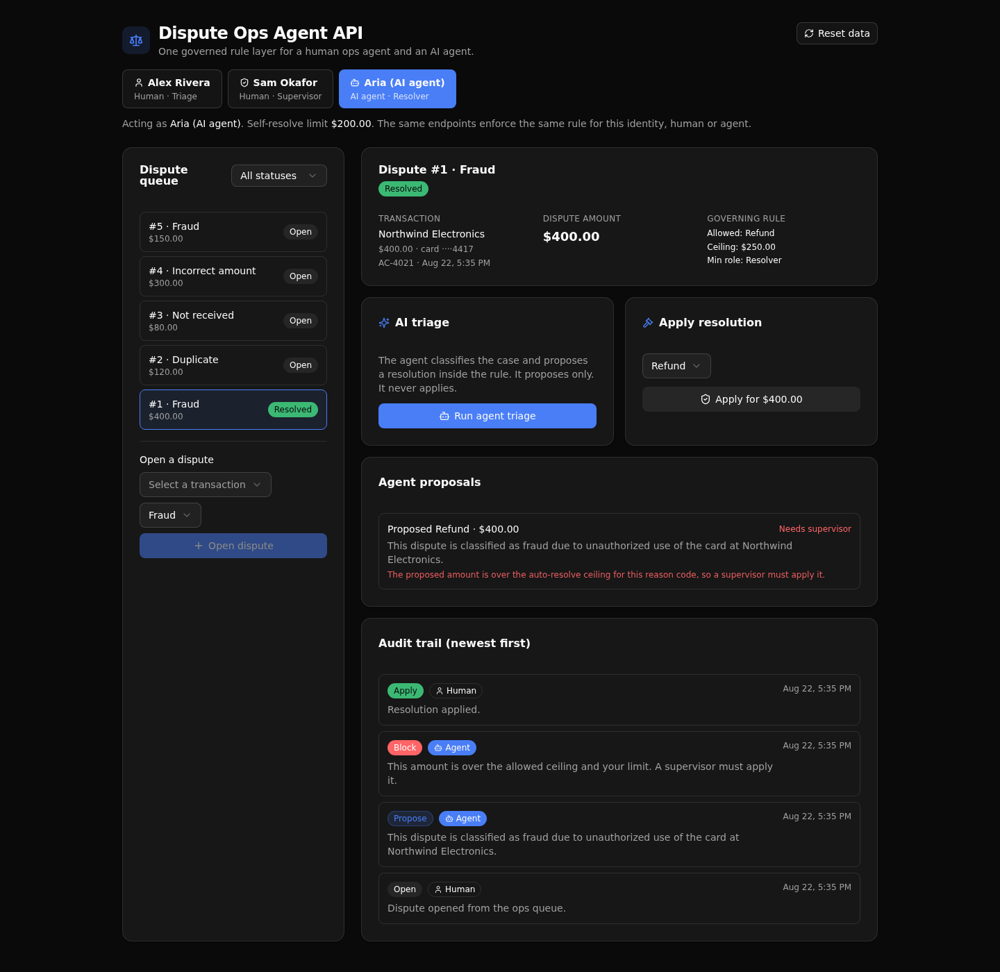

# Dispute Ops Agent API

One governed rule layer for a bank's chargeback disputes, called the same way by a human ops
operator and by an AI agent. The agent triages and proposes. The rule layer decides. Every action,
human or agent, lands in one audit trail.



**6 tables · 7 endpoints · 1 AI agent**

## What it demonstrates

This is a **Play 4 (Agent Intelligence Layer)** proof for **banking and financial services**. It
answers the one question a bank's Director of AI has before letting an agent touch disputes: can the
agent do anything a policy would forbid a person? Here it cannot, because the same API-layer rule
blocks both.

- **The agent calls the same endpoints a human does.** The AI triage endpoint reads a case and
  proposes a resolution inside the policy it is handed. It proposes only. It never writes the final
  resolution.
- **One rule guards the apply endpoint for everyone.** A resolution is checked against the caller's
  role, the caller's self-resolve limit, and the reason code's ceiling. An over-ceiling resolution
  is refused for the AI agent and for a non-supervisor human alike. Only a supervisor can apply it.
- **Permissions live at the API layer.** Auth is an auth table plus token minting plus per-endpoint
  role guards (preconditions). There is no row-level security. The rule a reviewer reads in
  `xano/api/cases-resolve.ts` is the rule the engine runs.
- **Everything is audited.** Each governed action writes one row, tagged human or agent, and the
  dispute detail shows the human and agent steps interleaved in time.

A reviewer can open a dispute, run the AI triage, watch the agent get blocked by the same rule that
blocks a person, switch to a supervisor, and watch it go through. That is the whole point in one
screen.

## Repo layout

```
xano/
  index.ts                 registers the tables, the API group, the agent, and the endpoints
  tables/                  operators (auth), transactions, disputes, decision_rules,
                           dispute_actions (audit), agent_runs
  api/                     the seven endpoints (one file each) + the pinned API group
  agents/                  the dispute triage agent (xano-free, no API key)
frontend/
  src/lib/api.ts           the one contract: paths and types derived from the query defs
  src/components/          the identity switcher, the queue, and the dispute detail
docs/                      the landing page and the screenshot above
```

## API surface

All endpoints live under the `dispute` API group. The two write endpoints that matter carry the
governance.

| Method | Path | What it enforces |
| ------ | ---- | ---------------- |
| POST | `/api:dispute/seed` | Bootstraps demo data and returns a token per identity. Idempotent, so a refresh keeps your work. |
| POST | `/api:dispute/login` | Exchanges email and password for a token. |
| POST | `/api:dispute/cases/open` | Opens a dispute after checking the reason code has a rule. Writes an open action. |
| POST | `/api:dispute/triage` | The AI agent classifies the case and proposes the allowed resolution. Records the proposal and flags it when it is over the ceiling. Proposes only. |
| POST | `/api:dispute/cases/resolve` | Applies a resolution behind the shared role and limit guard. Writes an apply action when it passes, a block action when it does not. |
| GET | `/api:dispute/cases` | Lists disputes, with an optional status filter. |
| GET | `/api:dispute/cases/{dispute_id}` | One case with its transaction, its rule, its full audit trail, and its agent runs. |

## Quick start

```sh
git clone https://github.com/xano-scratch/dispute-ops-agent-api.git
cd dispute-ops-agent-api
npm install
npx xanots login
npm run xano:deploy
```

`npm run xano:deploy` builds the backend and the frontend and prints a live URL. Open it. The app
seeds itself the first time it loads, signs you in as each identity, and drops you in the queue. Use
the identity switcher at the top to act as the human triage operator, the human supervisor, or the
AI agent, then run a triage and try to apply a resolution.

For local work, `npm run dev` runs the frontend and `npm run typecheck` keeps the types honest.

## FAQ

**Is this row-level security?** No. Permissions are enforced at the API layer with an auth table,
token minting, and per-endpoint role guards. That is Xano's auth model.

**Does it need any API keys?** No. The triage agent uses the platform-provided `xano-free`
provider, so the whole app runs on seed data with no external credentials.

**Who decides the resolution amount, the agent or the rule?** The agent picks the resolution type
that policy allows. The endpoint derives the amount from that type, so a model cannot invent a figure
that dodges the ceiling check.

**Is the data real?** No. It is seed data for a demo. Reset it any time with the Reset button in the
app.

**Where is the rule?** In `xano/api/cases-resolve.ts`. It reads as plain logic a reviewer can audit,
and it is the same code the engine runs for the agent and for a human.
